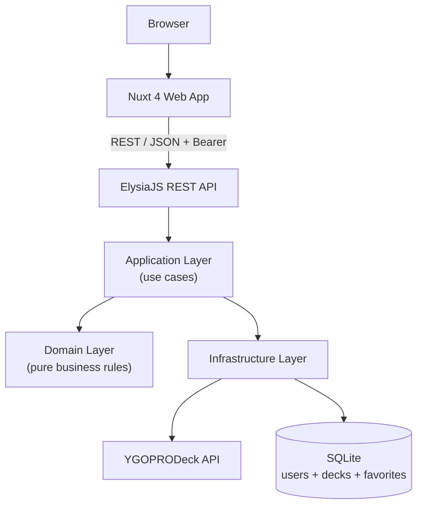
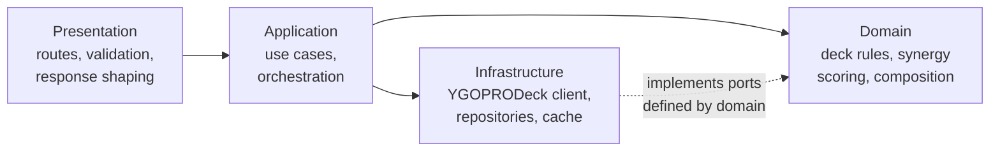
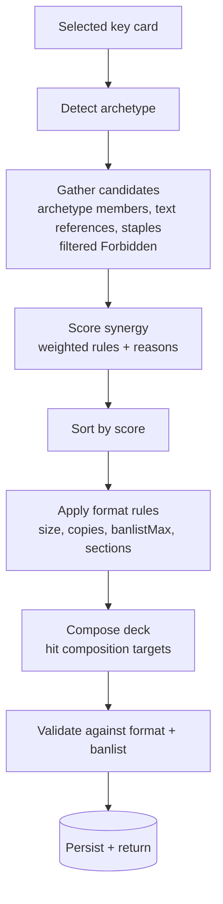

# DuelDex

**Explore cards. Build smarter decks.**

DuelDex is a full-stack Yu-Gi-Oh! card explorer and smart deck builder. Browse and filter thousands of cards, save per-user favorites, build decks by hand, or pick a single key card and let DuelDex generate a complete, format-legal deck around it — with an explanation for every card it recommends. All persistence is SQLite (`users`, `decks`, `favorites`) with JWT auth.

The differentiator is the last part:

> Select a card → DuelDex understands its archetype and relationships → DuelDex recommends a deck around it.

This is a card explorer and deck builder. It is deliberately **not** a duel simulator — there is no gameplay, turn system, or effect resolution engine.

---

## Table of contents

- [Features](#features)
- [Screenshots](#screenshots)
- [Architecture](#architecture)
- [Monorepo structure](#monorepo-structure)
- [Tech stack](#tech-stack)
- [YGOPRODeck integration](#ygoprodeck-integration)
- [Smart deck recommendation engine](#smart-deck-recommendation-engine)
- [Supported formats](#supported-formats)
- [API endpoints](#api-endpoints)
- [Local development](#local-development)
- [Environment variables](#environment-variables)
- [Testing](#testing)
- [Deployment (Render)](#deployment-render)
- [Known limitations](#known-limitations)
- [Future roadmap](#future-roadmap)

---

## Features

**Card discovery**
- Full-text search with debounced input
- Filter by card type, attribute, level/rank, archetype, **race**, **ATK/DEF exact**, and **sort** (`name/atk/def/level`)
- Server-side pagination over the full card pool (max 60)
- Loading, empty, and error states on every request
- Shareable URL query (`?search=&type=&race=&atk=&sort=`)

**Card information**
- Large artwork, full effect text, and complete stat breakdown
- Level / Rank / Link handled correctly per card kind
- **Banlist badge** (`Forbidden/Limited/Semi-Limited` from `banlist_info.ban_tcg`) on detail and in validation
- Archetype links straight into a filtered explorer view

**Authentication & profile**
- `POST /api/auth/register` + `POST /api/auth/login` -> HMAC-SHA256 JWT (7d, `Bun.password` bcrypt)
- `GET /api/auth/me` + `PUT /api/auth/me` for profile
- `POST /api/auth/refresh` to renew JWT
- Profile fields: `username`, `email`, `displayName` (nama), `age` (1-120), `gender` (`male`/`female`), `country`, `avatar`
- Avatar: client-side WebP conversion (`createImageBitmap` + `canvas.toBlob('image/webp',0.8)`) **5 MB limit** enforced client and server (`data:image/webp;base64,`), stored as TEXT in SQLite `users.avatar`

**Favorites (per-user SQLite)**
- One-tap favoriting from grid/detail, `GET/POST/DELETE /api/favorites` requires `Authorization: Bearer <JWT>`
- `favorites(user_id, card_id)` PK, `onDelete CASCADE`
- Dedicated `/favorites` page (login required, shows count + empty state)

**Deck building**
- Manual construction with quantity controls (+/-), automatic Main/Extra/Side placement per format (`sectionForCard`)
- **Live Deck Stats** + **analysis**: `main/extra/side` counts, `monster/spell/trap` breakdown, `levelCurve`, `ATK histogram (0-1000/1000-2000/2000-3000/3000+)`, `archetype breakdown`, `avgLevel/avgAtk` (`domain/deck/deck-rules.ts:240` + `DeckStats.vue`)
- **Real banlist validation** (`Forbidden 0 / Limited 1 / Semi-Limited 2`) + copy/section/size checks (`domain/deck/deck-rules.ts:197`)
- Rename, clear, save, share, **visibility toggle** (`isPublic`), **edit existing deck** via `?editId=` (load `GET /api/decks/:id` + `loadFromDeck`)
- **Limit 5 decks per user** (`DeckService.ts:45` `enforceDeckLimit` via `countByOwner`) — create/generate/clone `422` when full, edit/delete still allowed

**Smart deck generation**
- Pick a key card, get a complete legal deck (40 main + 15 extra for Yu-Gi-Oh!, 40 main for Rush)
- Rule-based synergy scoring with human-readable reasons, filtered to exclude `Forbidden` cards and respect `Limited/Semi` copy caps (`deck-composer.ts:31` `banlistMax`)
- Format-specific composition (not one algorithm with a different label)
- Regenerate on demand

**Deck sharing & My Decks**
- Short, opaque public URLs (`/deck/ab3f9k2xqp`), `POST /:id/share` returns canonical `PUBLIC_WEB_URL`
- `POST /:id/clone` (counts toward limit), `DELETE /:id`
- **My Decks** (`/decks`): requires auth, `GET /api/decks?q=&sort=name/updated&order=asc/desc&page=&pageSize=` paginated (`{items, pagination}`), search, sort, pagination, `Public/Private` toggle, `Edit` -> `?editId=`

---

## Screenshots

> _Placeholder — add screenshots here._

| View | Screenshot |
| --- | --- |
| Landing page | `docs/screenshots/landing.png` |
| Card explorer (filters + sort) | `docs/screenshots/cards.png` |
| Card detail (banlist) | `docs/screenshots/card-detail.png` |
| Deck builder + analysis | `docs/screenshots/deck-builder.png` |
| Generated deck + reasons | `docs/screenshots/generator.png` |
| My Decks (search/pagination) | `docs/screenshots/my-decks.png` |
| Profile (avatar WebP) | `docs/screenshots/profile.png` |
| Shared deck | `docs/screenshots/shared-deck.png` |

---

## Architecture

The frontend never talks to YGOPRODeck directly. Every request flows through the DuelDex API, which normalizes external data into internal domain models.



The backend follows clean architecture with a strict dependency direction. The domain layer has **zero** imports from Elysia, HTTP, SQLite, or YGOPRODeck — it is pure, testable TypeScript.



Dependency inversion: domain declares `CardRepository`, `DeckRepository`, `FavoritesRepository`, `UserRepository` and infrastructure implements them. Swapping SQLite for Postgres touches one file in `infrastructure/` and nothing else. `apps/api/src/container.ts` is the sole composition root — single `Database` singleton (`infrastructure/db/database.ts:7` `getDatabase()` WAL + FK ON).

### Deck generation flow



---

## Monorepo structure

```
dueldex/
├── apps/
│   ├── web/                          # Nuxt 4 frontend
│   │   └── app/
│   │       ├── components/
│   │       │   ├── cards/            # CardGrid, CardItem, CardFilters, CardDetail (banlist), ...
│   │       │   ├── deck/             # DeckHeader, DeckSection, DeckStats (analysis), DeckGenerator, DeckRecommendation
│   │       │   ├── layout/           # AppHeader (avatar), AppFooter
│   │       │   └── common/           # LoadingState, ErrorState, EmptyState, Pagination
│   │       ├── composables/
│   │       │   ├── useApi.ts         # single gateway, Bearer handling
│   │       │   ├── useCards.ts       # search, filters (race/atk/def/sort), pagination
│   │       │   ├── useFavorites.ts   # per-user favorites via /api/favorites
│   │       │   ├── useAuth.ts        # JWT + profile + convertToWebP (5MB)
│   │       │   ├── useDeck.ts        # builder, generation, sharing, 5-limit
│   │       │   └── useDeckDraft.ts   # cross-route card queue
│   │       ├── pages/
│   │       │   ├── index.vue         # landing
│   │       │   ├── login.vue / register.vue / profile.vue
│   │       │   ├── cards/index.vue   # explorer (query sync)
│   │       │   │   └── [id].vue      # card detail
│   │       │   ├── favorites.vue
│   │       │   ├── decks/index.vue   # My Decks (q/sort/page/isPublic)
│   │       │   └── deck/
│   │       │       ├── new.vue       # builder + generator + ?editId=
│   │       │       └── [id].vue      # shared deck (public)
│   │       └── assets/css/main.css
│   │
│   └── api/                          # Bun + ElysiaJS backend
│       ├── src/
│       │   ├── domain/               # pure business logic
│       │   │   ├── card/ {CardRepository, FavoritesRepository}
│       │   │   ├── user/ {User, UserRepository}
│       │   │   ├── deck/ {DeckRepository, deck-rules (banlist), deck-composer (banlistMax), synergy-*}
│       │   │   └── errors.ts
│       │   ├── application/
│       │   │   ├── cards/CardService.ts
│       │   │   ├── favorites/FavoritesService.ts
│       │   │   ├── auth/AuthService.ts # register/login/me/refresh/updateProfile (WebP 5MB)
│       │   │   └── decks/ {DeckService (5-limit, isPublic), DeckGeneratorService}
│       │   ├── infrastructure/
│       │   │   ├── db/database.ts    # singleton + migrations (users, decks owner_id/is_public, favorites)
│       │   │   ├── auth/jwt.ts       # HMAC-SHA256 sign/verify
│       │   │   ├── ygoprodeck/ {YgoProDeckClient, YgoProDeckMapper (banlist_info), YgoProDeckRepository, format-pools, types}
│       │   │   ├── repositories/ {SqliteUserRepository, SqliteDeckRepository, SqliteFavoritesRepository, InMemoryDeckRepository, deck-id}
│       │   │   └── cache/TtlCache.ts
│       │   ├── presentation/
│       │   │   ├── routes/{cards,decks,favorites,auth}.ts
│       │   │   ├── middleware/auth.ts
│       │   │   └── http/responses.ts
│       │   ├── container.ts
│       │   ├── config.ts
│       │   └── index.ts
│       └── tests/                    # 83 tests (bun:test)
│
├── packages/
│   └── shared/src/                   # types shared by web + api
│       ├── card.ts (Card + BanlistInfo)
│       ├── deck.ts (Deck isPublic, DeckStats levelCurve/atkHistogram)
│       ├── api.ts (CardQuery race/atk/def/sort, ApiErrorCode UNAUTHORIZED)
│       ├── format-rules.ts
│       └── index.ts
│
├── package.json                      # Bun workspaces
├── AGENTS.md
├── render.yaml
└── README.md
```

---

## Tech stack

**Frontend**
- [Nuxt 4](https://nuxt.com/) (4.5) with Vue 3.5 and the Composition API
- TypeScript in strict mode (`allowImportingTsExtensions`)
- Tailwind CSS v4 + [Nuxt UI](https://ui.nuxt.com/) v3

**Backend**
- [Bun](https://bun.sh/) 1.4 runtime and test runner
- [ElysiaJS](https://elysiajs.com/) 1.4 with `t` schema validation
- `bun:sqlite` for persistence (WAL, FK ON, inline migrations)
- TypeScript in strict mode

**Shared**
- `@dueldex/shared` workspace package — one definition of every DTO, consumed by both API and web.

---

## YGOPRODeck integration

All card data comes from the [YGOPRODeck API](https://ygoprodeck.com/api-guide/). External shapes are confined to the infrastructure layer:

```
YGOPRODeck API
      ↓  raw snake_case JSON (YgoCardResponse)
YgoProDeckClient      timeouts, HTTP errors, malformed payloads, empty results (400 -> [])
      ↓
YgoProDeckMapper      snake_case → camelCase, drops invalid entries, maps banlist_info -> Card.banlist
      ↓
Domain Card           clean internal model
      ↓
Application → REST response
```

Notable handling:

- **Timeouts** — every upstream call aborted after `UPSTREAM_TIMEOUT_MS` and surfaces as `UPSTREAM_TIMEOUT`.
- **Empty results** — upstream returns HTTP 400 with `error` string when nothing matches. Maps to `[]` rather than an error.
- **Malformed data** — cards missing id/name/type are skipped.
- **Banlist** — `banlist_info.ban_tcg/ban_ocg/ban_goat` mapped to `Card.banlist` (`YgoProDeckMapper.ts:18`).
- **Caching** — in-process TTL cache (default 1 hour) fronts lists/details/candidate pools (rate-limit 20/s, asks to cache).
- **Images** — hot-linked from YGOPRODeck; mirror to CDN for production.

---

## Smart deck recommendation engine

Every candidate is scored against the key card using weighted, named rules. No randomness — same key card always produces same deck. Forbidden cards are filtered at `gatherCandidates` and via `banlistMax` in `deck-composer.ts`.

All weights live in `domain/deck/synergy-config.ts`:

| Signal | Weight |
| --- | --- |
| Same archetype | +50 |
| Explicitly names the key card | +30 |
| Named *by* the key card (reciprocal) | +25 |
| Mentions the key card's archetype | +22 |
| Supports archetype strategy (search/revive/equip) | +20 |
| Same attribute | +10 |
| Same race | +5 |
| Easily summoned (Level ≤ 4) | +4 |
| Generic utility (draw/search/removal) | +3 |

Each score carries reasons shown in UI:

```
Magician's Rod
Synergy Score: 122
✓ Same archetype (Dark Magician)
✓ Directly references Dark Magician
✓ Supports the archetype strategy
...
```

Copies scale with synergy (`≥70` at limit, `≥40` at 2, else 1) clamped by banlist (`Forbidden 0 / Limited 1 / Semi 2`). Composition targets shape monster/spell/trap spread.

---

## Supported formats

Format rules are data, defined once in `packages/shared/src/format-rules.ts`.

| Rule | Yu-Gi-Oh! | Rush Duel |
| --- | --- | --- |
| Main Deck | 40–60 | 40–60 |
| Extra Deck | 15 | **none** |
| Side Deck | 15 | **none** |
| Max copies per card | 3 (banlist stricter) | 3 |
| Monster / Spell / Trap targets | 55% / 30% / 15% | 60% / 32% / 8% |

```
Yu-Gi-Oh!  →  40 Main (22 monster / 12 spell / 6 trap) + 15 Extra
Rush Duel  →  40 Main (24 monster / 13 spell / 3 trap) +  0 Extra
```

---

## API endpoints

All responses use a consistent envelope.

Success: `{ "success": true, "data": {} }` — Failure: `{ "success": false, "error": { "code": "...", "message": "..." } }`

### Auth

| Method | Path | Description |
| --- | --- | --- |
| `POST` | `/api/auth/register` | `{username, email, password}` -> `{user, token}` |
| `POST` | `/api/auth/login` | `{username, password}` (username or email) -> `{user, token}` |
| `POST` | `/api/auth/refresh` | `Authorization: Bearer <token>` -> new `{user, token}` |
| `GET` | `/api/auth/me` | `Bearer` -> `{user}` (profile) |
| `PUT` | `/api/auth/me` | `Bearer` `{displayName?, age?, gender?, country?, avatar?}` avatar must be `data:image/webp;base64,` ≤5 MB |

Profile fields: `displayName` 1-50, `age` 1-120, `gender` `male/female`, `country` 2-56, `avatar` WebP data URL. User: `{id, username, email, displayName, age, gender, country, avatar, createdAt, updatedAt}`.

### Cards

| Method | Path | Description |
| --- | --- | --- |
| `GET` | `/api/cards` | Search/filter with pagination |
| `GET` | `/api/cards/search` | Alias |
| `GET` | `/api/cards/:id` | Single card (includes `banlist {tcg,ocg,goat}`) |
| `GET` | `/api/cards/meta/filters` | `{types, attributes, races, archetypes, levels}` |

Query: `search`, `type`, `attribute`, `race`, `archetype`, `level`, `atk`, `def`, `sort` (`name/atk/def/level`), `page`, `pageSize` (max 60).

### Favorites (Bearer required)

| Method | Path | Description |
| --- | --- | --- |
| `GET` | `/api/favorites` | List favorite cards (full `Card[]`) |
| `POST` | `/api/favorites` | `{cardId}` |
| `DELETE` | `/api/favorites/:cardId` | Remove |
| `DELETE` | `/api/favorites` | Clear all |

### Decks

| Method | Path | Description |
| --- | --- | --- |
| `GET` | `/api/decks` | **Bearer** list own decks paginated: `?q=&sort=name/updated&order=asc/desc&page=&pageSize=` -> `{items, pagination}` |
| `POST` | `/api/decks` | Create (validated) `{name, format, cards, keyCardId?, isPublic?}` `201`, **5 per user** limit |
| `GET` | `/api/decks/:id` | Fetch by public id (public) |
| `PUT` | `/api/decks/:id` | Update `{name?, cards?, keyCardId?, isPublic?}` (owner check) |
| `DELETE` | `/api/decks/:id` | Delete (owner check) |
| `POST` | `/api/decks/:id/share` | `{shareId, url}` via `PUBLIC_WEB_URL` |
| `POST` | `/api/decks/:id/clone` | Clone (counts toward limit) `201` |
| `POST` | `/api/decks/generate` | **Smart generation** `{format, keyCardId, name?}` -> `{deck: DeckDetail, scores: CardScore[]}` (Bearer sets `owner_id`, respects 5-limit + banlist) |

`DeckDetail` includes `stats {mainCount, extraCount, sideCount, monsterCount, spellCount, trapCount, levelCurve, atkHistogram, archetypeBreakdown, avgLevel, avgAtk}` + `isPublic`.

### Error codes

`BAD_REQUEST`, `VALIDATION_ERROR`, `NOT_FOUND`, `CARD_NOT_FOUND`, `DECK_NOT_FOUND`, `INVALID_DECK` (includes `BANNED/LIMITED/SEMI_LIMITED`), `UNAUTHORIZED`, `UPSTREAM_ERROR`, `UPSTREAM_TIMEOUT`, `INTERNAL_ERROR`.

---

## Local development

**Prerequisites:** [Bun](https://bun.sh/) 1.1+.

```bash
git clone <your-repo-url> dueldex
cd dueldex
bun install
cp apps/api/.env.example apps/api/.env
cp apps/web/.env.example apps/web/.env
# edit JWT_SECRET in apps/api/.env for non-dev
bun run dev
# or
bun run dev:api    # http://localhost:3001
bun run dev:web    # http://localhost:3000
```

Other scripts:

```bash
bun test           # backend suite (83 tests)
bunx tsc --noEmit  # typecheck api individually (avoids nuxt volar bug)
bun run typecheck  # typecheck api + web (web uses bunx tsc internally)
bun run build      # production build of web
```

---

## Environment variables

### `apps/api/.env`

| Variable | Default | Description |
| --- | --- | --- |
| `API_PORT` | `3001` | Port |
| `YGOPRODECK_API_URL` | `https://db.ygoprodeck.com/api/v7` | Upstream |
| `CORS_ORIGIN` | `http://localhost:3000` | Comma-separated allowed origins |
| `PUBLIC_WEB_URL` | `http://localhost:3000` | Share link base |
| `DATABASE_PATH` | `./data/dueldex.sqlite` | SQLite file |
| `JWT_SECRET` | `dev-secret-change-me` | HMAC secret (change in prod) |
| `UPSTREAM_TIMEOUT_MS` | `12000` | Upstream timeout |
| `CACHE_TTL_MS` | `3600000` | Card cache TTL |

### `apps/web/.env`

| Variable | Default | Description |
| --- | --- | --- |
| `NUXT_PUBLIC_API_BASE_URL` | `http://localhost:3001` | DuelDex API base URL |

Only `NUXT_PUBLIC_*` reaches the browser.

---

## Testing

```bash
bun test                    # all 83 tests
bun test tests/deck-generator.test.ts
```

Coverage is business-logic focused, offline via fakes (`InMemoryDeckRepository`, `createTestDatabase()` not singleton) — no network:

| Area | Covered |
| --- | --- |
| **Cards** | search, filtering (each facet + race/atk/def/sort), pagination, detail, filter metadata |
| **Mapping** | snake_case → camelCase, banlist_info, malformed payloads, link markers, placeholder images |
| **Deck rules** | placement, add/remove, quantity, copy limits, banlist (Forbidden/Limited/Semi), both formats' size/section |
| **Generator** | key card included, archetype prioritized, size, copy limits + banlistMax, extra handling, Yu-Gi-Oh vs Rush divergence, deterministic scoring, 5-limit, forbidden filter |
| **Sharing** | share id, retrieval, uniqueness, opacity, invalid id |
| **Auth/Profile** | register/login/me/refresh/updateProfile (avatar WebP 5MB), JWT HMAC, 5-limit enforcement |
| **Security** | deck name sanitization, invalid decks, unknown cards |

```
 83 pass
  0 fail
 206 expect() calls
```

---

## Deployment (Render)

`render.yaml` defines two services from one repo.

1. Push to GitHub.
2. In Render, **New → Blueprint** → select repo (`render.yaml` auto-detected).
3. Set cross-referencing vars once URLs known:
   - `dueldex-api` → `CORS_ORIGIN` and `PUBLIC_WEB_URL` = web URL
   - `dueldex-web` → `NUXT_PUBLIC_API_BASE_URL` = API URL
   - `JWT_SECRET` = strong random string (both services if sharing)
4. Deploy. Both install from repo root for workspace.

**Persistence warning:** Free plan filesystem is ephemeral, so `DATABASE_PATH` (`/tmp/dueldex.sqlite` in `render.yaml:36`) resets on deploy/restart — shared links break. Attach a Render disk and point `DATABASE_PATH` at it, or implement Postgres `DeckRepository` (behind interface, one file change).

---

## Known limitations

- **Rush Duel card pool.** YGOPRODeck documents `format=Rush Duel` but endpoint currently returns no cards (verified 2026-09-03). Rush sources from Speed Duel (`infrastructure/ygoprodeck/format-pools.ts`) while keeping its own construction rules. Single constant to change when upstream restores.
- **Card images are hot-linked** from YGOPRODeck. Mirror to your own storage/CDN for production.
- **Avatar storage** is base64 WebP TEXT in `users.avatar` (5 MB client + server validated via `AuthService.ts:42`). For scale, move to object storage (S3/R2) and store URL.
- **My Decks `isPublic`** defaults `true`; `GET /api/decks/:id` is public. Private decks are still fetchable by id if known — add auth check on `GET /:id` if stricter privacy needed.
- **Search `atk/def` exact** only — range queries are not delegated to upstream (would need local post-filter + full fetch).

---

## Future roadmap

```
Future
├── Deck import / export (.ydk) + copy as ydk/QR
├── Competitive deck analysis (meta decks)
├── Duel simulator / CPU opponent / Online PvP
└── Postgres DeckRepository (swap in container.ts)
```

Implemented from previous roadmap: `User authentication`, `Cloud deck storage (SQLite per-user)`, `Deck statistics & analysis`, `Banlist validation` — see `AGENTS.md` for agent notes.

---

## Credits

Card data and artwork from [YGOPRODeck](https://ygoprodeck.com/api-guide/). Yu-Gi-Oh! is a trademark of Konami. DuelDex is an unofficial, non-commercial fan project.
